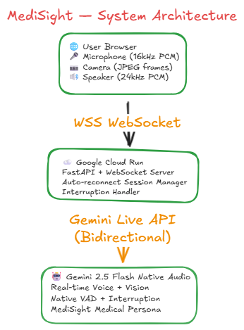

# 🏥 MediSight — Real-Time AI Medical Visual Assistant

<div align="center">


**Talk naturally. Show your camera. Get instant medical guidance.**

[🌐 Live Demo](https://medisight-563984701112.us-central1.run.app) • [📹 Demo Video](#demo-video) • [🏗️ Architecture](#architecture)

</div>

---

## 🚨 The Problem

Every day, millions of people face a terrifying moment:

- They pick up a pill bottle and can't read the label
- They receive a hospital discharge paper full of medical jargon
- They notice a symptom on their skin and don't know if it's serious
- They're in a pharmacy in a foreign country and can't understand the packaging

**In Nigeria alone, over 200 million people have limited access to medical professionals.** Globally, 4.5 billion people lack access to basic healthcare. When something looks wrong, they turn to Google — and often get the wrong answer, or worse, get scared by irrelevant results.

**MediSight changes that.**

---

## 💡 The Solution

MediSight is a **real-time AI medical visual assistant** that you can talk to naturally — like calling a knowledgeable doctor friend. Show it your camera, speak your question, and get an instant, warm, clear answer in plain English.

No appointments. No waiting rooms. No confusing medical jargon. Just answers.

### What MediSight Can Do

| Capability | Example |
|-----------|---------|
| 💊 **Medication Analysis** | Point camera at a pill bottle → get dosage, side effects, warnings |
| 📋 **Prescription Reading** | Show a doctor's prescription → get plain English explanation |
| 🩺 **Symptom Assessment** | Describe or show symptoms → understand severity and next steps |
| 🏥 **Medical Document Translation** | Show lab results or discharge papers → understand what they mean |
| 🥗 **Nutrition Label Analysis** | Point at food packaging → get health advice for your condition |
| 🚨 **Emergency Detection** | AI detects emergencies and immediately advises calling services |

---

## 🎯 Built for the Gemini Live Agent Challenge

**Category:** Live Agents 🗣️ — Real-time Interaction (Audio/Vision)

MediSight is built specifically to showcase the power of the **Gemini Live API** for real-world social impact:

- ✅ **Real-time voice conversation** — natural, interruptible, human-like
- ✅ **Live camera vision** — sees what you show it in real time
- ✅ **Native interruption handling** — speak any time, AI stops and listens
- ✅ **Deployed on Google Cloud Run** — production-ready, globally accessible
- ✅ **Built with Google GenAI SDK** — `gemini-2.5-flash-native-audio-latest`

---

## 🎬 Demo Video

> *[Insert your 4-minute demo video link here]*

**What the demo shows:**
1. MediSight greeting and introducing herself
2. Real-time medication analysis via camera
3. Natural voice conversation with interruption
4. Medical document explanation
5. Symptom assessment

---

## 🏗️ Architecture


```
┌─────────────────────────────────────────────────────────────┐
│                        USER BROWSER                          │
│                                                              │
│  🎤 Microphone → PCM Audio (16kHz)                          │
│  📷 Camera    → JPEG Frames (every 2s)                      │
│  🔊 Speaker   ← PCM Audio (24kHz)                           │
│                                                              │
│  AudioWorklet (VAD + capture) | WebSocket Client            │
└─────────────────────┬───────────────────────────────────────┘
                      │ WSS (WebSocket Secure)
                      │ Audio chunks + Video frames
                      ▼
┌─────────────────────────────────────────────────────────────┐
│              GOOGLE CLOUD RUN (Backend)                      │
│                                                              │
│  FastAPI + WebSocket Server                                  │
│  ├── Audio/Video relay to Gemini                            │
│  ├── Session management + auto-reconnect                    │
│  ├── Interruption signal handling                           │
│  └── Keepalive (silent PCM frames)                         │
└─────────────────────┬───────────────────────────────────────┘
                      │ Gemini Live API (v1alpha)
                      │ Bidirectional streaming
                      ▼
┌─────────────────────────────────────────────────────────────┐
│           GEMINI 2.5 FLASH NATIVE AUDIO                      │
│                                                              │
│  ├── Real-time audio understanding                          │
│  ├── Live camera vision analysis                            │
│  ├── Native VAD (Voice Activity Detection)                  │
│  ├── Natural interruption handling                          │
│  └── MediSight persona + medical knowledge                  │
└─────────────────────────────────────────────────────────────┘
```

### Tech Stack

| Layer | Technology |
|-------|-----------|
| **AI Model** | `gemini-2.5-flash-native-audio-latest` via Gemini Live API |
| **Backend** | Python 3.11, FastAPI, WebSockets |
| **Frontend** | Vanilla JS, Web Audio API, AudioWorklet |
| **Deployment** | Google Cloud Run |
| **SDK** | Google GenAI SDK (`google-genai==1.64.0`) |

---

## 🚀 Getting Started

### Prerequisites

- Python 3.11+
- Google Gemini API Key ([Get one free at AI Studio](https://aistudio.google.com))
- Google Cloud account (for deployment)
- Chrome browser (required for AudioWorklet + WebRTC)

### Local Setup

**1. Clone the repository**
```bash
git clone https://github.com/okaforpascal400/medisight.git
cd medisight
```

**2. Install dependencies**
```bash
cd backend
pip install -r requirements.txt
```

**3. Set up environment variables**
```bash
# Create .env file in the root directory
echo "GEMINI_API_KEY=your_api_key_here" > .env
```

**4. Run the server**
```bash
cd ..
python backend/main.py
```

**5. Open in Chrome**
```
http://localhost:8080
```

**6. Start a session**
- Click **Start Session**
- Allow microphone access
- Talk naturally — MediSight will introduce herself
- Show your camera to analyze medications or documents

---

## ☁️ Deploy to Google Cloud Run

**Prerequisites:** Google Cloud CLI installed and authenticated

```bash
# Set your project
gcloud config set project YOUR_PROJECT_ID

# Copy frontend into backend for deployment
xcopy /E /I /Y frontend backend\frontend  # Windows
# OR
cp -r frontend backend/frontend  # Mac/Linux

# Deploy
gcloud run deploy medisight \
  --source ./backend \
  --region us-central1 \
  --allow-unauthenticated \
  --set-env-vars GEMINI_API_KEY=YOUR_API_KEY \
  --memory 2Gi \
  --port 8080
```

Your app will be live at:
```
https://medisight-YOUR_PROJECT_ID.us-central1.run.app
```

---

## 🔑 Key Technical Features

### 1. Real-Time Bidirectional Audio Streaming
- Captures microphone at **16kHz PCM** using AudioWorklet
- Streams audio chunks to Gemini Live API continuously
- Receives **24kHz PCM** audio responses and plays gaplessly

### 2. Professional Interruption Handling
- **AudioWorklet VAD** runs on dedicated OS audio thread (125 readings/second)
- When user speaks, AI stops **instantly** — no finishing sentences
- `interruptPending` gate blocks buffered audio chunks from replaying
- Full `AudioContext` recreation ensures clean slate after interruption

### 3. Auto-Reconnect Session Management
- Gemini Live sessions auto-reconnect with exponential backoff
- Silent PCM frames keep connection alive between turns
- Input queue survives session drops — no lost messages

### 4. Live Camera Vision
- Captures JPEG frames every 2 seconds via `getUserMedia`
- Sends frames as `video/jpeg` blobs via `send_realtime_input`
- Gemini analyzes visual context alongside voice in real time

---

## 📁 Project Structure

```
medisight/
├── backend/
│   ├── main.py              # FastAPI server + Gemini Live integration
│   ├── requirements.txt     # Python dependencies
│   └── Dockerfile           # Container configuration
├── frontend/
│   ├── index.html           # Main UI
│   ├── app.js               # WebSocket client + audio/video logic
│   ├── audio-processor.js   # AudioWorklet processor (VAD + capture)
│   └── style.css            # Dark blue medical UI theme
├── deploy.sh                # Automated Cloud Run deployment
├── .gitignore
└── README.md
```

---

## 🌍 Social Impact

MediSight is designed with **accessibility and equity** at its core:

- **Works in any browser** on any device — no app download required
- **Voice-first design** — works for people who struggle with reading
- **Camera-powered** — helps people who can't read medication labels
- **Free to use** — no subscription, no paywall for basic health guidance
- **Always available** — 24/7, no appointments needed

> *"In Nigeria and across Africa, millions of people self-medicate without guidance because they can't access a doctor. MediSight gives everyone a knowledgeable medical friend in their pocket."*

---

## ⚠️ Medical Disclaimer

MediSight provides **general health information only**. It does not provide medical diagnoses and is not a substitute for professional medical advice. Always consult a qualified healthcare professional for medical decisions. In an emergency, call your local emergency services immediately.

---

## 🏆 Hackathon Submission

- **Event:** Gemini Live Agent Challenge
- **Category:** Live Agents — Real-time Interaction (Audio/Vision)
- **Mandatory Tech:** Gemini Live API + Google Cloud Run
- **Builder:** Pascal Okafor ([@okaforpascal400](https://github.com/okaforpascal400))

---

## 📝 License

MIT License — see [LICENSE](LICENSE) for details.

---

<div align="center">

**Built with ❤️ using Gemini Live API and Google Cloud**

*MediSight — Because everyone deserves a medical friend*

</div>
